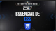
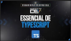
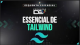

# Esquenta Essencial - Formação DEV

Repositório para o estudo da série [**Esquenta Essencial**](https://www.youtube.com/playlist?list=PLdPPE0hUkt0raBdbQiTBy1l15AIEL6YCU), que aborda as principais tecnologia para desenvolvimento moderno de web fullstack, oferecido pelo canal **Cod3r Cursos** na plataforma **Youtube**.

> Repositório oficial do curso no Github: [Esquenta Essencial](https://github.com/formacaodev/esquenta-essencial)

## Principais Tecnologias abordadas na série:

## Outras Technologias Utilizadas

## Conceitos aprendidos:

**1. HTML**  
Elementos, Sintaxe do HTML, Formulários, Navegação e Mídias.

**2. CSS**:  
Seletores, Integração com HTML, Modelo Caixa, Display, Responsividade.

**3. JAVASCRIPT**:  
Dados & Operadores, Estrutura de Controle, Funções, Objetos & Arrays, Assincronismo (Promise & Async/Await).

**4. TYPESCRIPT**:  
Tipos, Interface, Classes, POO (Programação Orientada a Objetos), Módulos.

**5. REACT**:  
Componente, JSX, Propriedades (Props), Estado, Hooks.

**6. NEXT JS**:  
Rotas, Layouts & Templates, Componentes Cliente vs Servidor, Server Actions, Middleware.

**7. TAILWIND**:  
Filosofia do Tailwind, Classes Utilitárias, Box Model, Display, Responsividade.

**8. REACT NATIVE**:  
Componentes Básicos, Estilização dos Componentes, Navegação via Drawer, Navegação via Stack, Navegação via Tabs.

**9. NEST JS**:  
Módulo, Controller, Injeção de Dependência, Injectables (Service e Providers), Middleware.

**10. BANCO DE DADOS**:  
Mysql, Database, Tables, [Knex Js](https://knexjs.org/), [Prisma Js](https://www.prisma.io/).

## Links para os vídeos da série no YouTube:

